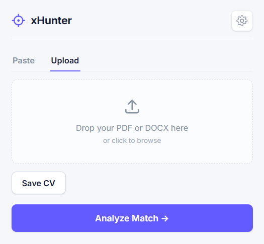
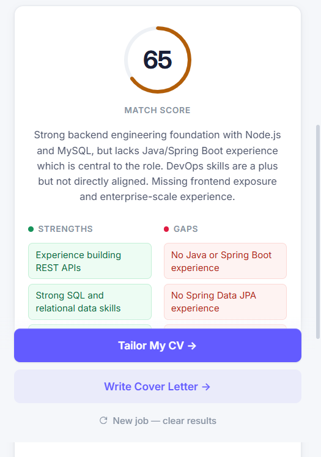
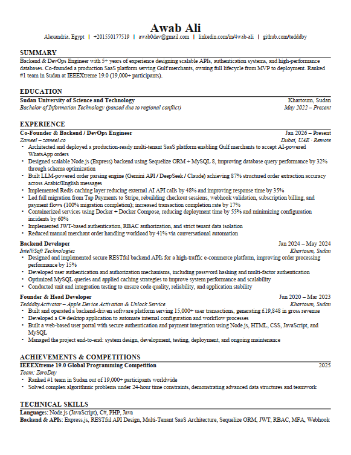

# xHunter

> Hunt the right job. A Chrome extension that scores your CV against any job posting, rewrites it to fit, and exports a clean, ATS-friendly PDF — all running locally in your browser.


One CV is never enough. Every posting wants different keywords in a different order, and ATS filters reject résumés before a human ever sees them. xHunter analyzes your CV against the job in front of you, tailors it — **without inventing anything** — and hands you a polished PDF in about a minute.

---

## Screenshots

<table>
  <tr>
    <td align="center" width="50%">
      <br>
      <sub><b>Paste or upload your CV, then Analyze</b></sub>
    </td>
    <td align="center" width="50%">
      <br>
      <sub><b>Match score, strengths, gaps &amp; keywords</b></sub>
    </td>
  </tr>
</table>

<p align="center">
  <br>
  <sub><b>The tailored CV, exported as a clean ATS-friendly PDF</b></sub>
</p>

---

## Features

- **Match analysis** — a match score, your strengths, the gaps, and keywords to add (click any keyword to copy it).
- **One-click tailoring** — rewrites your CV in the posting's language. Facts, dates, and companies stay 100% accurate; nothing is fabricated.
- **Professional PDF export** — a clean, ATS-parsable résumé layout (centered header, ruled sections, bullets) generated with jsPDF.
- **Paste or upload** — paste plain text, or drop a **PDF / DOCX** and it extracts the text for you.
- **Private by design** — your CV and API key live in `chrome.storage.local`. The only network calls go to `api.deepseek.com`, and only when you click Analyze/Tailor.
- **Resilient** — API calls run in the background service worker and cache their results, so closing the popup mid-request doesn't lose progress.

---

## Install (Load unpacked)

Not on the Chrome Web Store — it's open source, so you load it directly:

1. Clone or download this repo:
   ```bash
   git clone https://github.com/tedddby/xHunter.git
   ```
   (or **Code → Download ZIP** and extract)
2. Open `chrome://extensions`
3. Enable **Developer Mode** (top-right)
4. Click **Load unpacked** and select the `xHunter` folder (the one containing `manifest.json`)

No build step — everything is vendored and ready to run.

## Setup — DeepSeek API key

Get a key at [platform.deepseek.com](https://platform.deepseek.com), click the **gear icon** in the popup, paste it, and Save. It's stored locally and only sent to DeepSeek.

## Usage

1. Open any job-posting page.
2. Click the **xHunter** toolbar icon.
3. **Paste** your CV or **Upload** a PDF/DOCX, then **Save CV** (persists across sessions).
4. **Analyze Match** → scrapes the job description and shows your score, strengths, gaps, and keywords.
5. **Tailor My CV** → rewrites your CV for the role.
6. **Download Tailored CV** → saves `CV_Tailored_<timestamp>.pdf`.
7. **New job** clears the results to start fresh (your saved CV and key stay).

---

## How it works

- **Manifest V3**, vanilla JavaScript, no backend.
- `content.js` scrapes the visible job description from the active tab.
- `background.js` (service worker) makes both DeepSeek calls and writes results to `chrome.storage.local`; the popup renders off `storage.onChanged` so a single result is shown exactly once, even if the popup was reopened mid-run.
- **Stage 1** returns the match analysis as JSON; **Stage 2** returns the tailored CV as structured JSON, which the popup renders to PDF with jsPDF (Times, US Letter, 0.5″ margins, ruled section headers) for a classic, ATS-friendly résumé.
- All libraries are bundled in `libs/` — **no CDN calls at runtime** (Chrome blocks them for extensions anyway).

## Project structure

```
manifest.json     MV3 config
popup.html/.js    UI, CV input/parsing, match report, jsPDF generation
styles/popup.css  design system (light, indigo accent)
content.js        scrapes the job description from the active tab
background.js     DeepSeek API calls (analysis + tailoring) + result caching
libs/             jsPDF, mammoth, pdf.js, pdf.worker (vendored)
fonts/            Inter (variable woff2)
icons/            generated brand mark (16/48/128)
tools/            icon generator (dev-only, pure Node)
```

Regenerate icons with `node tools/gen-icons.mjs`.

## Contributing

Issues and PRs are welcome — bug reports, more robust job-description scraping for specific sites, extra résumé sections, or UI polish. Keep it dependency-free and client-side.

## Credits

PDF layout inspired by the [Jake Gutierrez résumé template](https://github.com/sb2nov/resume) (MIT). Bundled libraries and their licenses:

- [jsPDF](https://github.com/parallax/jsPDF) — MIT
- [mammoth.js](https://github.com/mwilliamson/mammoth.js) — BSD-2-Clause
- [pdf.js](https://github.com/mozilla/pdf.js) — Apache-2.0
- [Inter](https://github.com/rsms/inter) — SIL OFL 1.1

## License

MIT © Awab Ali
